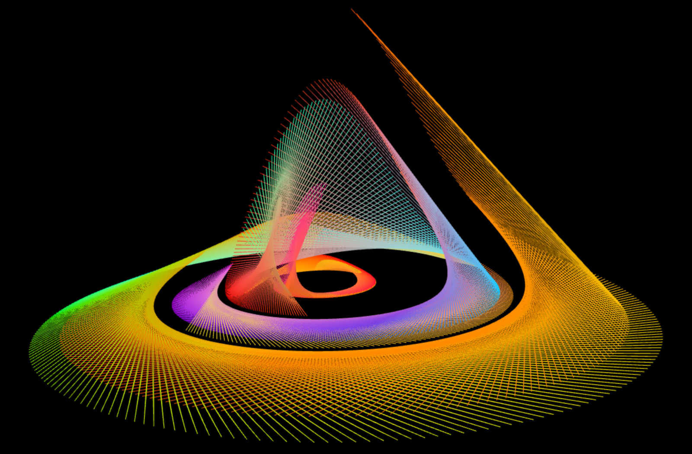

# **Computational Sketches**



This repository serves as a collection of exploratory Three.js and React visualizations that focus on implementing mathematical, chaotic, or generative systems. These sketches are self-contained demos designed to showcase performance optimization and the correct integration of physics and graphics loops within a modern single-page application (SPA) environment.

## **Projects**

### **The Rössler Attractor**

**Summary**

An interactive, high-performance visualization of the Rössler Attractor, a classic system in chaos theory. The visualization tracks the non-periodic path of three distinct particles (representing three coupled differential equations) using THREE.Line geometry and a circular buffer.

**Technical Highlights**

* 4th-Order Runge-Kutta (RK4) Integration: Used for accurate and stable numerical simulation of the chaotic system.

* Circular Buffer Implementation: Manages the trail geometry to display a dense, continuous line without memory leaks, ensuring high framerates.

* Refactoring Case Study: The project includes a dedicated comparison demo to illustrate and solve a critical issue: using useRef to correctly encapsulate mutable state (particle positions and drawing pointers) and avoid state collision with the React render cycle, demonstrating best practices for integrating Three.js into a modern React application.

**Technical Stack**

* Three.js: A JavaScript 3D library for creating the interactive visualizations.

* React: A JavaScript library for building component-based user interfaces with declarative state management.

* Vite: A next-generation frontend tool that provides instant server starts and quick Hot Module Replacement.

## **Setup**
Clone the repository
```
git clone https://github.com/michaelraymondmorales/computational-sketches.git
```
Change directory to the application folder
```
cd computational-sketches/rossler-attractor/frontend/rossler-attractor-app
```

Install dependencies
```
npm install 
```

Start the development server
```
npm run dev
```

## **Contributing**

Contributions are welcome\! If you have suggestions for improvements, new features, or bug fixes, please open an issue or submit a pull request.

## **License**

This project is licensed under the [MIT License](LICENSE).

## **Contact**

Michael Raymond Morales  
E-mail: michaelraymondmorales@gmail.com  
Project Link: https://github.com/michaelraymondmorales/computational-sketches  
LinkedIn Profile: https://linkedin.com/in/raymond-morales-1727023